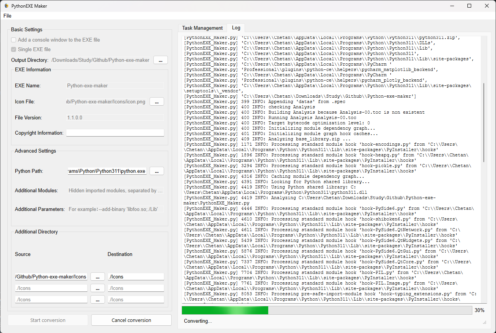

##### This library is a port of the library https://github.com/yeahhe365/PythonEXE_Maker. I have added more option and made certain improvements to the code.
# PythonEXE Maker


**PythonEXE Maker** is an open source and free tool designed to convert Python scripts into standalone executable files (EXE). Through a friendly graphical user interface, users can easily configure conversion parameters, manage multiple conversion tasks, and customize various properties of the generated EXE file, such as icon, version information, etc.

## Features

- **Drag and drop support**: Directly drag `.py` files into the program window to quickly add conversion tasks.

- **Batch conversion**: Convert multiple Python scripts to EXE files at once.

- **Custom settings**:
  - Option to add a console window or hide the console window.
  - Option to select single file or single directory.
  - Specify the output directory.
  - Set the EXE file name.
  - Add a custom icon (supports `.png` and `.ico` formats, `.png` will be automatically converted to `.ico`).
  - Configure version information and copyright information of the file.
  - Specify additional hidden import modules and additional PyInstaller parameters.
- **Task management**: View the progress and status of each conversion task in real time.
- **Log viewing**: Detailed conversion log for easy troubleshooting.
- **Dependency check**: Automatically check and prompt to install necessary dependency libraries when the program starts.

## Screenshots

### Main interface


### Log view



## Installation

### Prerequisites

- **Operating system**: Windows

- **Python version**: Python 3.6 and above

- **Dependencies**:

  - [PyQt5](https://pypi.org/project/PyQt5/)

  - [Pillow](https://pypi.org/project/Pillow/)

  - [PyInstaller](https://pypi.org/project/PyInstaller/)

### Installation steps

1. **Clone repository**

    ```bash
    git clone [https://github.com/yeahhe365/PythonEXE_Maker.git](https://github.com/chetanjain2099/Python-exe-maker)
    cd Python-exe-maker
    ```

2. **Create a virtual environment (optional)**

    ```bash
    python -m venv venv
    source venv/bin/activate # For Windows users, use venv\Scripts\activate
    ```

3. **Install dependencies**

    ```bash
    pip install -r requirements.txt
    ```

    *If there is no `requirements.txt` file, please install the dependencies manually:*

    ```bash
    pip install pyside6-essentials Pillow PyInstaller
    ```

## Instructions

1. **Run the program**

    ```bash
    python PythonEXE_Maker.py
    ```

2. **Configure conversion parameters**

   - **Console Window**: Select whether the generated EXE is with a console (command line mode) or without a console.
   - 
   - **Single File**: Select whether the generated EXE is a single file or a single directory.

   - **Output directory**: Specify the storage location of the generated EXE file, which defaults to the directory where the source file is located.

   - **EXE information**:

     - **EXE name**: Set the name of the generated EXE file, which defaults to the same name as the source file.

     - **Icon file**: Select an icon file for EXE, supporting `.png` and `.ico` formats.

     - **File version**: Set the version number of the EXE file (format: X.X.X.X).
     - **Copyright information**: Set the copyright information of the EXE file.
   
   - **Advanced settings**:
     - **Additional modules**: Enter the module names that need to be hidden import. Multiple modules are separated by commas.
     - **Additional arguments**: Enter additional command line arguments for PyInstaller.
   
   - **Additional Directory**: Specify the source and destination location of the directory to be included in the folder.

3. **Add conversion task**

   - **Drag and drop files**: Drag the `.py` file directly into the drag and drop area of the program window.
   - **Browse files**: Click the "Browse files" button to select the Python script to be converted.

4. **Start conversion**

   - Click the "Start Convert" button and the program will start converting the selected Python script.
   - During the conversion process, you can view the progress and status of each task in the "Task Management" tab.
   - The Conversion logs can be viewed in detail in the "Log" tab.

5. **Cancel conversion**

   - During the conversion process, you can click the "Cancel Conversion" button to stop all ongoing conversion tasks.

## Contribution

Any form of contribution is welcome! You can participate in the following ways:
  - **Submit a Pull Request**: Fork this repository, make modifications and submit a Pull Request, we will review it as soon as possible.
